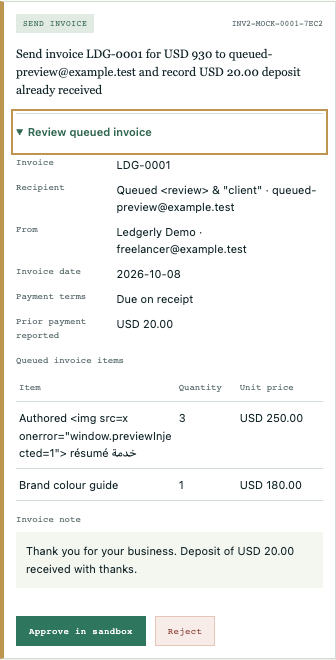
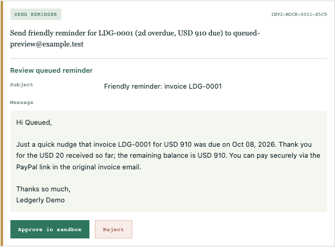

# Review the queued invoice or reminder before approval

Issue: [#22](https://github.com/Jacob-Met/ledgerly/issues/22).
Native owner: `chatgpt:5f566b5ec8ef:production`.
Qualified base: `1b2b902d5dd412a8b61c9b9075b815c1d0029365`.

## User-visible result

Each pending invoice card now opens with the recipient, sender, invoice date, payment terms, any explicit due date, item quantities and unit prices, reported prior payment, and invoice note. A reminder card displays its subject and complete selectable message. These values come from that card's existing pending action, so analyzing a different email does not replace the contents awaiting approval.

The original Approve in sandbox and Reject actions remain bound to their pending action IDs. Opening or closing an invoice preview and selecting reminder text cause no Worker request or approval. Amounts and quantities remain the queued strings; the renderer performs no numeric conversion, recalculation, currency merging, or inferred due-date calculation. All inserted text and action attributes are escaped.





The browser still runs the repository's Python core and SandboxMock entirely in its worker. This contribution changes no Python modules, bridge, approval permits, provider operations, dependencies, workflow definitions, or recovery runtime.

## Source boundaries

The runtime changes are a typed renderer, scoped styles, two imports in `web-demo/src/main.ts`, and replacement of its approval-list rendering expression. All existing approve, reject, busy-state and engine-recovery handlers remain unchanged.

The whole base contains 206 tracked leaves; only three existing files change, and all 203 unowned original leaves are preserved. See [preservation.json](preservation.json). Four new source/qualification files and this evidence directory are additive.

The seven source and qualification files are pinned in [source-freeze.json](native/source-freeze.json). The renderer's final SHA-256 is `b284a7b7e646b916272266566e3c7740062123505ade1913b803f80b8a6091ff`.

The existing recovery test evaluates import-stripped main.ts in a VM with explicitly supplied dependencies. Its only change imports and supplies the real new renderer. No recovery assertions or simulated worker behavior were changed.

## Native qualification

Qualification used the actual Mac environment, Node v26.3.0, Vitest 5.0.3, Chrome 154.0.8037.98 and the pinned repository Pyodide dependency. The existing dependency tree was cloned into this isolated workspace after verifying an identical package-lock; no dependency versions were changed.

| Boundary | Result | Evidence |
| --- | --- | --- |
| Actual baseline browser | Both invoice and reminder payloads existed in the Python queue, while the cards exposed neither invoice items nor reminder subject/body. Expected negative result, exit 1. | [Baseline receipt](native/browser-baseline-v1/browser.json) |
| Full initial test run | 29 passed and 4 recovery-fixture failures caused by the new import not yet being supplied to the VM. All 7 new renderer/Pyodide tests passed. | [Original log](native/tests.log) |
| Recovery fixture integration | All 5 recovery tests passed after adding the actual renderer binding, with every original assertion retained. | [Targeted replay](native/recovery-binding.log) and [command receipt](native/fixture-binding-replay.json) |
| Final renderer/Pyodide controls | 7 passed after final unit-label polish. Exact decimal strings, literal markup, actual queued invoice/reminder content, independent actions and no preview effects are covered. | [Final focused log](native/final-preview-tests.log) |
| Final production build | TypeScript checks and Vite build passed. Existing Pyodide Node-builtin externalization notices are retained in the log. | [Build log](native/final-build.log) |
| Final real browser | 14 grouped checks passed across desktop 1440×1000 and phone 390×844; zero page errors and zero off-origin requests. Actual queued data and original approve/reject operations were used. | [Browser receipt](native/browser-candidate-final/browser.json) |
| Independent review | Separate worker verified all seven hashes, read the source and interaction helper, checked the final native receipts, and inspected the phone invoice. No blocker found. It did not repeat suites or builds. | [Peer review](native/peer-review/mac-continuity-approval-preview-review.json) |

Across the initial test run and the necessary recovery fixture replay, all 33 unique tests were qualified. This was not an uninterrupted all-green initial run. The final seven focused tests qualify the only subsequent renderer wording change: generic quantities use the Quantity column heading, and hours use “hr”, without parsing the values. Hosted CI results, when available, are reported separately in the pull request.

### Browser controls

The browser helper starts a temporary loopback server for the real production bundle, opens fresh isolated Chrome profiles, and blocks off-origin requests. A Worker subclass records and forwards actual messages; it does not substitute worker responses or Python state.

It checks exact queued recipient, terms, item and deposit text with literal markup and Unicode; keyboard disclosure without effects; preservation after a different email is analyzed; the selected invoice's normal approval and prior-payment recording; exact selectable reminder subject/body; removal of invalidated previews; current action IDs through reject/approve; and independent currency cards. Full synthetic Worker transcripts are retained for [desktop](native/browser-candidate-final/desktop-worker-observation.json) and [phone](native/browser-candidate-final/phone-worker-observation.json).

### Retained qualification corrections

The first browser invocation stopped after two passing checks because the helper attempted to select repository fixture 02 from a menu that did not offer it. No application error or off-origin request occurred. The helper was corrected to paste that same fictional repository fixture through the existing email input; no application source, assertion or timeout was altered for this correction. The [initial failure](native/browser-candidate-v1/browser.json), [original helper](native/check_approval_preview_browser-v1.py), [correction record](native/browser-harness-correction.json) and [successful follow-up receipt](native/browser-candidate-v2/browser.json) are preserved. Baseline mode did not reach this absent-option path and remains a valid negative witness.

The final browser run followed a small visual correction to the unit label and passed all 14 checks on the exact frozen source. The [final command receipt](native/final-qualification.json) records each exit and log hash. The [evidence manifest](native-evidence-manifest.json) pins all 27 retained native artifacts, including the failures and screenshots.

## Reproduce

From `web-demo`, run the repository's normal `npm test` and `npm run build`. The focused renderer tests are `tests/approval-preview.test.ts`.

For actual browser qualification, use an environment with Playwright and a native Chrome executable:

```sh
python -I -B web-demo/tools/check_approval_preview_browser.py \
  --source "$PWD" \
  --dist "$PWD/web-demo/dist" \
  --chrome /path/to/chrome \
  --output /path/to/new-qualification-directory
```

Run this command from the repository root. The output directory must not already exist. Supply a built baseline and add `--baseline` to reproduce the expected missing-preview result. All input used in the retained run is fictional repository fixture data or explicitly synthetic review text.

## Receiving status at this source freeze

This packet proves the isolated native candidate and its unchanged-base comparison. Source publication, exact-head hosted CI, merge and the existing Pages deployment are subsequent receiving steps; none is implied by the local build or browser receipt.
