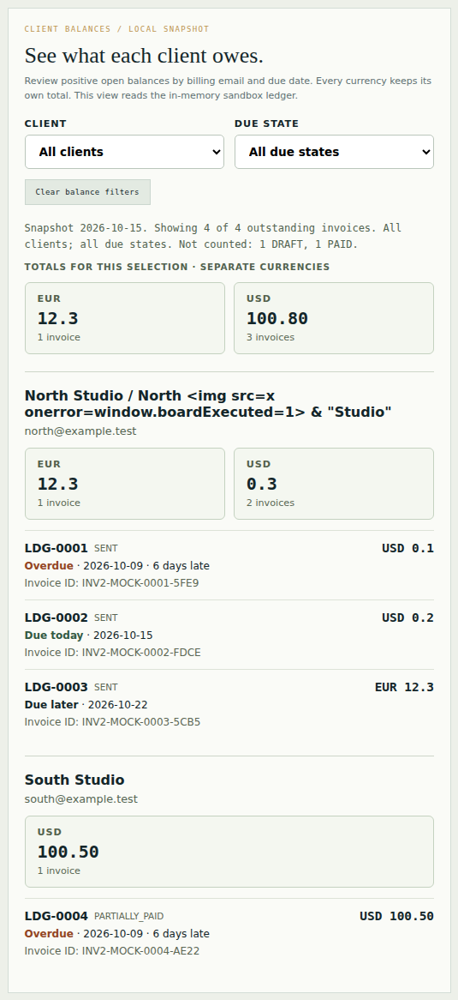
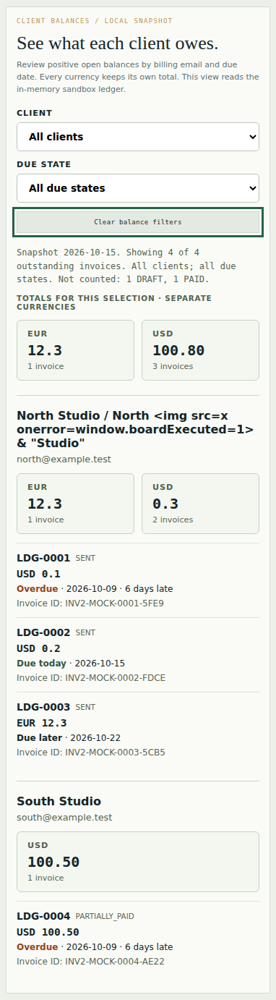

# Client receivables: integrated native and visual receiving

The client-balance board is integrated through [PR42](https://github.com/Jacob-Met/ledgerly/pull/42), and [issue39](https://github.com/Jacob-Met/ledgerly/issues/39) is complete. The [Ledgerly browser demo](https://jacobmetoyer.com/ledgerly/) now includes a read-only view of positive open balances by exact billing email, currency and due state.

## Accepted source and delivery

The normal expected-head merge is `295153cc0c354415c39bcee7d2384412b4fa629f`. Its tree, `599514b1ea0dc06edd0f8ed4acf7b1fdbbc49470`, is identical to hosted PR checkout `bfdebfa8326d0a883efb3a8b72c7483cb4a8b0c0`. Its parents are current main `fba278f5` and qualified head `ad9c6b60`.

The complete tree retains all 689 unrelated leaves of the 693-leaf original main. Four existing files contain additive board hooks, markup, documentation or test-harness binding; 22 paths are additions. Current Python and neighboring owners' source remain exact. The projection remains blob `c2d4f6bd9206d7199fe053bd45e2e8df2ad96ad9`, SHA256 `e40648104202ad83682a4e5d76f4c6332d37e5d50e3c834d15dd40e3aa826e68`.

[Pages run 37811465348](https://github.com/Jacob-Met/ledgerly/actions/runs/37811465348) deployed this merge successfully at 16:47:26 UTC. Its four content-hashed application asset names match the accepted Chrome build. All three post-merge qualification workflows also passed.

## Actual acceptance

| Gate | Result | Exact run |
| --- | --- | --- |
| Existing Python core | 337 tests and 118 subtests passed | [37810300249](https://github.com/Jacob-Met/ledgerly/actions/runs/37810300249) |
| Existing frontend suite | 100 tests in 11 files; audit and build passed | [37810300249](https://github.com/Jacob-Met/ledgerly/actions/runs/37810300249) |
| Independent native receiver | All five frozen cases passed through the real Python bridge | [37810300536](https://github.com/Jacob-Met/ledgerly/actions/runs/37810300536) |
| Existing invoice-record Chrome receiver | All eight controls passed | [37810300350](https://github.com/Jacob-Met/ledgerly/actions/runs/37810300350) |
| New receivables Chrome receiver | All six controls passed, with 30 real Worker calls | [37810300536](https://github.com/Jacob-Met/ledgerly/actions/runs/37810300536) |

The new Chrome run performs actual draft, explicit approval, partial/full payment and clock actions in the local Python engine. Its snapshots drive the displayed totals: North's USD 0.3 stays separate from EUR 12.3, and South's partially paid USD 100.50 contributes to the exact USD 100.80 selection total. Keyboard filters change only the board. Malformed transport, busy state, terminal session loss, explicit restart and populated reset exercise the real controller's availability rules. Source hashes remain unchanged, with no external requests or page errors.

## Inspected images

Both the author and independent root reviewer directly inspected these exact Chrome captures. The entire card, heading, controls and keyboard focus outline are visible. Literal client text, invoice hierarchy and separate currency totals are readable. The 390px layout wraps without horizontal overflow.

The snapshot date and exclusions note is 12px with measured 6.1996:1 contrast. The first passing functional run had an overly pale note and cropped capture framing. Its original source, logs and images remain preserved in [first-native-v1.zip](../first-native-v1.zip), with the precise three-path correction in [visual-correction-v2.json](../visual-correction-v2.json). First functional acceptance and final visual acceptance remain distinct.

## Evidence and limits

[receiving.json](receiving.json) records the merge, runs, source pins, visual verdict and Pages result. [native-browser.json](native-browser.json) is the unchanged actual Chrome receipt. [raw-evidence.zip](raw-evidence.zip) contains all final job logs, accepted native snapshot, rendered projection, original image bytes, capture manifest and integration pins; its 15 members were read back against their hashes. Archive SHA256: `61a18e9c3b0006eb2ec4a0fac33c6e1f05a4b3c17fe472c266ad1c4565bd3a29`.

The actual browser exercised the built application on the exact hosted checkout. Production delivery is independently confirmed by Pages' successful deployment and matching asset names; a separate public-host browser session was not run. The optional combined workflow-artifact URL returned 403 on one ordinary HTTPS read. The browser's five files had already been retrieved and verified independently through 105 indexed log-bundle chunks, and the exact independent peer TAP remains in the raw job log.

This archival receipt branch adds evidence only to the accepted merge. It does not introduce a new product source version or competing source scope.
