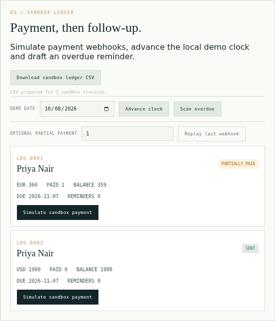
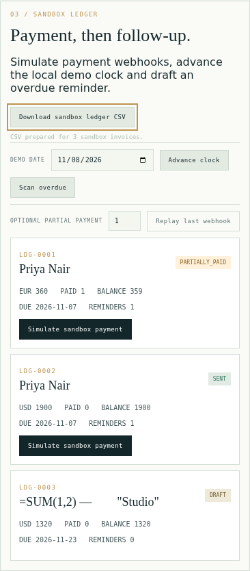

# Sandbox ledger CSV receiving

The actual browser workflow is qualified. Final current-main integration remains a separate gate.

## Actual received output

[Hosted run 37783466720](https://github.com/Jacob-Met/ledgerly/actions/runs/37783466720) checked out d9ba98b369de41cc7b4f79bd5de1956b1b108df2, exact tree 4ad1b34c7cd15616f2ae8e98ce672e18bd31648d. Chrome 154.0.8037.97, Python 3.12.15 and Playwright 1.63.0 exercised the actual built Pyodide/Worker application on Ubuntu, with only fictional inputs and loopback traffic.

All eight real downloaded files match the observed Python ledger and Python csv.writer's complete quoted/BOM/CRLF bytes. The cases cover drafts in separate currencies, explicit sends, partial payment, reminders, a corrected Unicode/formula-like client name, byte-identical repeat/retry, and focused Enter activation at 390 px. The full state and Worker request history remain unchanged by each download. All seven control groups pass, including busy/internal guard, failed download start, reset and synthetic terminal Worker loss. There were zero page errors and zero off-origin requests.

The same job passed 63 frontend tests and its production build; the paired job passed 179 Python tests plus 60 subtests. These figures belong to the exact source above, before the later separately owned PR30 scan-bound merge.

The full 66-chunk packet was recovered from the ordinary job log: 199918 bytes, SHA256 695c72b55c70a2e0df321dca392445402f8a9e051acee1abb51070c42aa3103c. All 19 file sizes and SHA256 hashes were checked independently with Python's standard library; their original Git blob identities are retained in [bundle-integrity.json](hosted-chrome/bundle-integrity.json). The raw CSV files, exact snapshots, receipt and screenshots are in hosted-chrome/. The complete original job logs are alongside this document; no download artifact or local disk was needed to preserve the packet.

The screenshots qualify layout/control visibility. Exact Unicode strings are qualified through the Worker/CSV values, without a claim about every platform's font glyph coverage. Failure controls cover download-start failure and a synthetic terminal Worker error; keyboard coverage is focused Enter activation.

## Source and earlier evidence

The CSV serializer/controller remains the exact original blob 6f65f1c5401408406b9706602cfd78ddf9277d11, with the unchanged 30-test set 3727493f7366db1771dcda96e4dd19ac4deb44f0. Native source/failure/capacity receipts remain in native/. The initial full suite's four missing-controller VM binding failures are preserved; the narrow binding fix then passed the existing hosted 56-test replay before the current 63-test composition.

[Independent production source review](https://github.com/Jacob-Met/ledgerly/pull/27#issuecomment-6060220272) confirms the real bridge/Decimal-string provenance and all controller boundaries. A separate source-only review of the strengthened browser receiver and CI setup accepted exact d362ce2d86b818e13f10341b1f31072f818b1fcf before execution. No original owner source or unrelated action ref was replaced.

The next composition retains actual main 2d3a90a9aa794d849ec54ca9d32a720959ddc5db and all PR21/24/26/30 work. The CSV feature and browser receiver bytes are unchanged. See receiving.json for exact pins and the final gate state. The held Mac browser run is not claimed as completed, and no live provider action is performed.

## Later current-main receiving

Run [37786675463](https://github.com/Jacob-Met/ledgerly/actions/runs/37786675463) passed on actual checkout `3e51e967b8e0db434a400dd6ac497d7f7ca9a243`, composed from source `575df8a3` and main `2d3a90a9`. It passed 64 frontend tests, 185 Python tests plus 63 subtests, audit/build, and all eight real Chrome downloads and seven control groups. The complete raw logs, seventeen distinct decoded files and integrity map are retained in the `hosted-chrome-main2d3` packet. Its two screenshots are byte-for-byte identical to the existing `hosted-chrome/` files and are linked by the integrity map. Invoice identifiers are generated per session; CSV equality is always checked against that run's own actual Worker snapshot.

Main subsequently merged the separately owned retained-invoice inspector at `2ab89fdd`. Its actual shared display, snapshot, loader and lifecycle changes justify a new ordinary hosted composition gate. This receiving commit preserves every inspector leaf and applies only the same existing CSV hooks and VM binding, plus both owners' README sections. The CSV controller, tests, HTML/CSS, browser receiver and workflow are unchanged. This last composition is not labeled tested before that gate completes.
